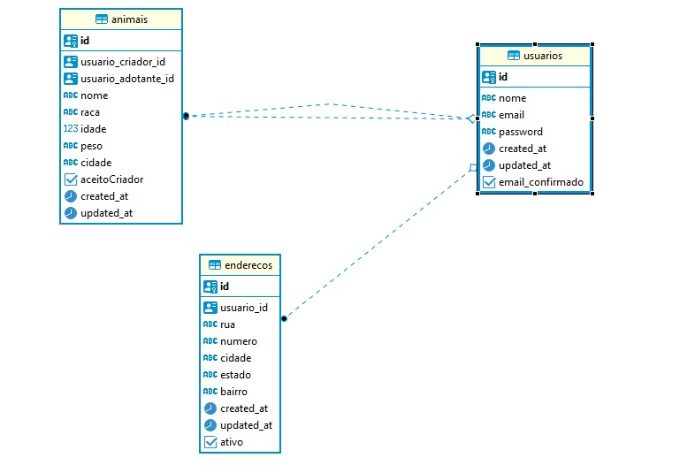

# Backend para o PetFinder
O Backend para o aplicativo Pet Finder foi desenvolvido utilizando NodeJs e TypeScript, no modelo MVC. Utilizei o TypeORM para realizar Migrations, e a comunicação com o banco de dados relacional PostGres SQL.

## Como Rodar
Para rodar no projeto é necessário ter o yarn em sua máquina.
```bash
npm install -g yarn
```

E instalar as dependências do projeto:
```bash
yarn install
```

Realize as migrations(Obs: É necessário ter o PostGres configurado em sua máquina): 
```bash
yarn typeorm migration:run
```

Para rodar o projeto, utilize:
```bash
yarn dev::server
```
## Modelo de Entidade Relacionamento


Nós temos as seguintes tabelas, com os seguintes campos:

Usuários:
* id : Id do Usuário
* nome: Nome do Usuário
* password: Senha encriptografada do Usuário
* created_at: Data e Hora de quando o usuário foi criado.
* updated_at: Data e Hora de quando o usuário foi atualizado.

Endereço (Eu sei que no E-mail solicitava que o endereço deveria ser em uma string, mas para relacionar a cidade com o Animal, a string não funcionaria, além de um usuário poder ter mais de um endereço):

* id : Id do Endereço
* rua: Rua da Casa
* numero: Número da Casa
* bairro: Bairro da Casa
* cidade: Cidade da Casa
* estado: Estado da Casa
* created_at: Data e Hora de quando o endereço foi criado.
* updated_at: Data e Hora de quando o endereço foi atualizado.
* ativo: Define se é o endereço principal do Usuário.

Animal:
* id : Id do Animal
* usuario_criador_id : O usuário que está doando o cachorro
* usuario_adotante_id : O usuário que adotou ou solicitou a adoção do cachorro
* nome: Nome do cachorro
* raca: Raça do cachorro
* peso: Peso do cachorro
* idade: Idade do cachorro
* cidade: Cidade do cachorro
* aceitoCriador: Campo para validar a adoção por parte do doador.


